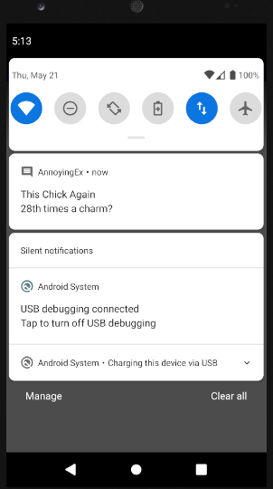
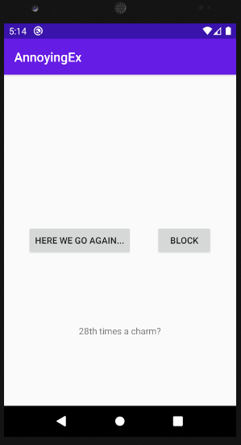

# HW5 - Worker Manager and Notifications - AnnoyingEx - Keith Roberts
In this weeks homework we stepped away from our usual Dotify app altogether and created a new application called AnnoyingEx.
This app utilizes androids workers & notifications to create the illusion of being spammed with texts from an annoying ex. The single main
activity contains a button for starting the messages from the annoying ex (that send approx 20 min apart) and a button to stop the messages from
coming. Once you receive a notification with a message, tapping on the notification displays the message below the two buttons.

## Extra credit
I have completed extra credit #1 (display text from notification in activity)

## Screenshots

## Installation & Usage
Clone the repository and build the gradle project and you're good to go!
